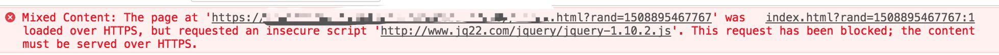

Piwik默认不启用SSL配置，当你期望在一个HTTPS的网站进行监控，浏览器会提示



error: `This request has been blocked; the content must be served over HTTPS.`

意思很明显，请求被阻止，当前内容必须在HTTPS上进行服务。也就意味着资源必须也适用HTTPS, 对于piwik, 最简单办法就是使用HTTPS方式来访问

Piwik开启SSL思路很简单，就是使用Nginx做一次反代，Nginx使用HTTPS，Piwik还是默认使用非HTTPS即可.

### 获取HTTPS证书

证书的获得路径很多，推荐使用阿里云，可以购买免费证书(每张证书1年，可以买20张，具体参考阿里云)，好处不在免费，而是这个证书是被CA机构认证过的，也就意味着被浏览器信任.

### 配置Nginx

```
server {
    listen       443 ssl;
    server_name  www.example.com;

    # 这两个安全凭证, 阿里云购买之后可以下载的到, 放在服务器任意目录下，这里引用即可
    ssl_certificate      /usr/local/piwik/214306432340174.pem;
    ssl_certificate_key  /usr/local/piwik/214306432340174.key;

    ssl_session_cache    shared:SSL:1m;
    ssl_session_timeout  5m;
    ssl_ciphers  HIGH:!aNULL:!MD5;
    ssl_prefer_server_ciphers  on;

    # SSL下，代理头很重要，否则代理将失败.
    location /piwik {
        proxy_pass   http://100.100.100.1:89;
        proxy_set_header Host $host;
        proxy_set_header X-Real-IP $remote_addr;
        proxy_set_header X-Forwarded-For $proxy_add_x_forwarded_for;
        proxy_redirect     off;
        proxy_set_header X-Forwarded-Proto  $scheme;
    }
}
```

### 验证

```
https://www.example.com/piwik
```
